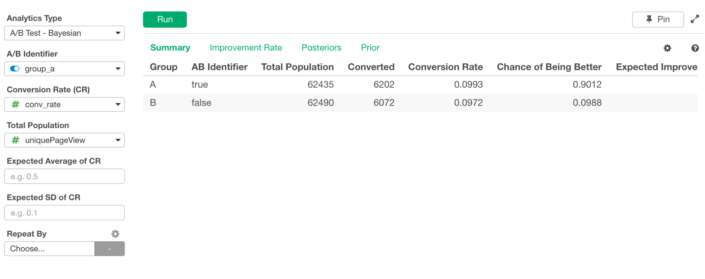
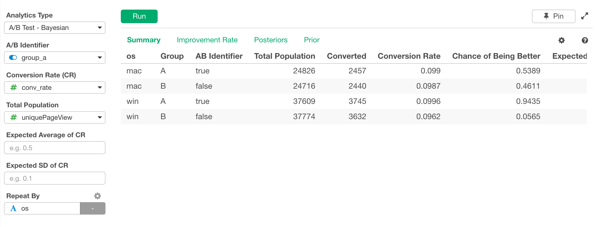
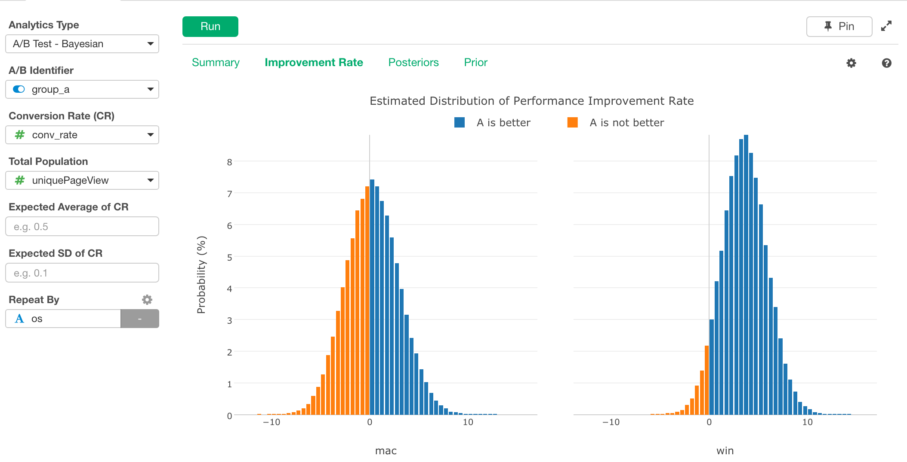
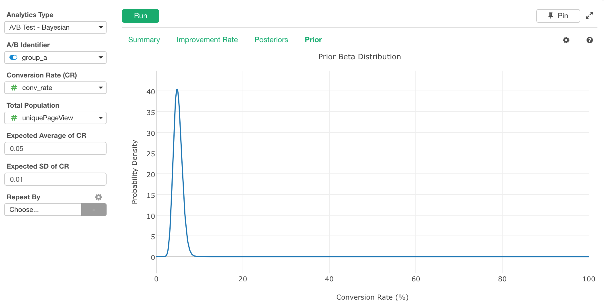
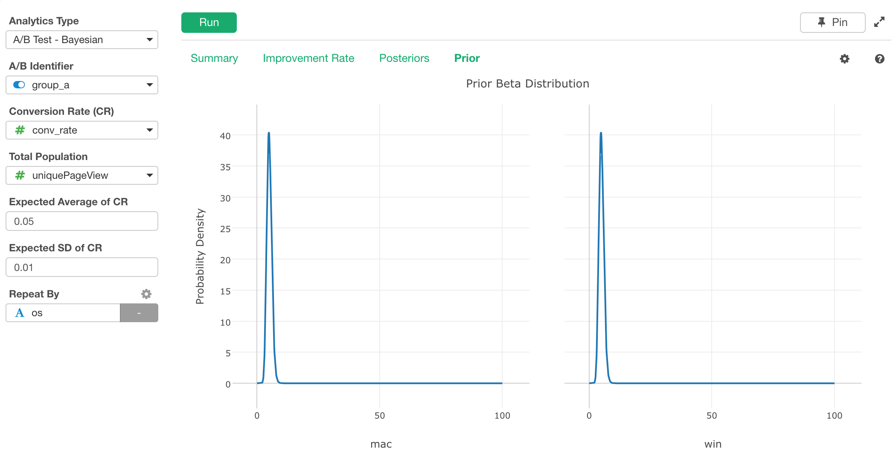

# A/B Test - Bayesian 
Analyzes A/B test result data based on Bayesian algorithm.

## Input Data
Input data should be a A/B test result data. Each row should represent one observation (e.g. total number of view and total number of sign up for a day for A group). It should have following columns.

* A/B Identifier - A column indicates this data is for group A or B. The data type can be in either logical, number or text. It should have only 2 unique values.
* Conversion Rate (CR) - A number column that conatins the ratio of the converted numbers against the total numbers. Numbers should be between 0 and 1.  
* Total Population - A number column that contains the total numbers. 
* Expected Averate of CR - Average CR value based on the historical data if you have.  
* Expected SD of CR - Standard Deviation of CR value based on the historical data if you have.  
* Repeat By - Optionally, if there are other columns that groups subjects, they can be used to draw separate survival curves for each group, for comparison between groups.

## How to Use This Feature
1. Click Analytics View tab.
1. If necessary, click "+" button on the left of existing Analytics tabs, to create a new Analytics.
1. Select "A/B Test - Bayesian" for Analytics Type.
1. Select Conversion Rate olumn with "Conversion Rate (CR)" column selector.
1. Select Total Population column with "Total Population" column selector.
1. (Optional) Enter an expected Averate of CR value from the historical data if you have. 
1. (Optional) Enter an expected Standard Deviation of CR value from the historical data if you have.  
1. (Optional) Select a column to group subjects with "Repeat By" column selector. For each group, a separate small chart will be displayed.
1. Click Run button to run the analytics.
1. Select view type (explained below) by clicking view type link to see each type of generated visualization.

### "Summary" View
"Summary" View displays the summary of the Bayesian A/B test analysis result in a table format.

This example is with Repeat By. 

#### Output Data
Following is the list of columns in the raw data displayed in the "Summary" View.
* Group Columns - If Repeat By is specified, the columns appears in the output data frame. 
* Group - Group name. Either A or B.
* AB Identifier - The actual A/B Identifier value. 
* Total Population - Total Population value. 
* Converted - Number of population converted. 
* Conversion Rate - A number column that conatins the ratio of the converted numbers against the total numbers.
* Chance of Being Better - Probability of being better. Between 0 and 1. 
* Expected Improvement Rate - Expected improvement rate of conversion rate. 
* Credible Interval Low - Lower bound of credible interval of the expected improvement rate.
* Credible Interval High - Upper bound of Credible interval of the expected improvement rate. 
* Expected Loss Rate - Average loss rate of conversion rate assuming A is worse. 

### "Improvement Rate" View
"Improvement Rate" View displays the estimated distribution of the performance improvement rate. 

This example is with Repeat By. 

### "Posteriors" View
"Posteriors" View displays posteriors of the conversion rate. 

This example is with Repeat By. 

### "Prior" View
"Prior" View displays prior beta distribution derived from Expected Average of CR and Expected SD of CR. 

This example is with Repeat By. 

## R Package

The "A/B Test - Bayesian" Analysis uses [`bayesAB`](https://cran.r-project.org/web/packages/bayesAB/index.html) R Package under the hood.

## Exploratory R Package

For details about `bayesAB` usage in Exploratory R Package, please refer to the [github repository](https://github.com/exploratory-io/exploratory_func/blob/master/R/do_bayes_ab.R)
