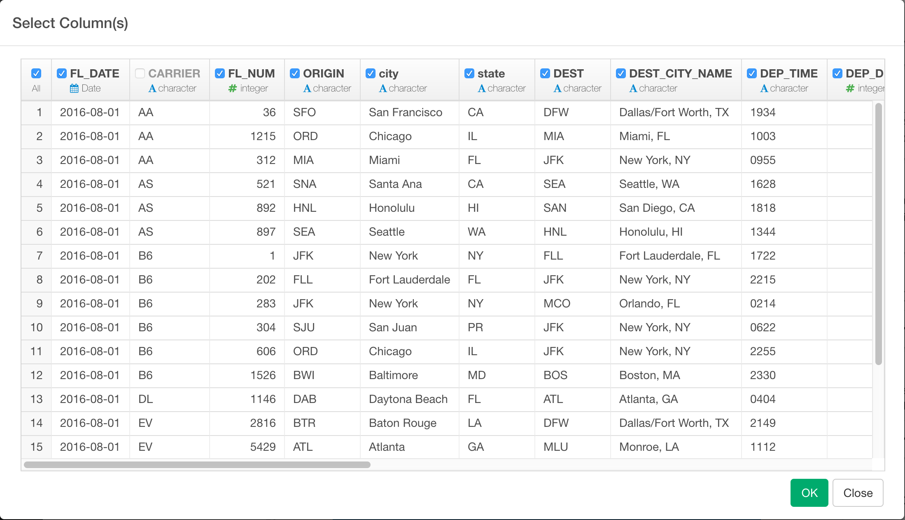
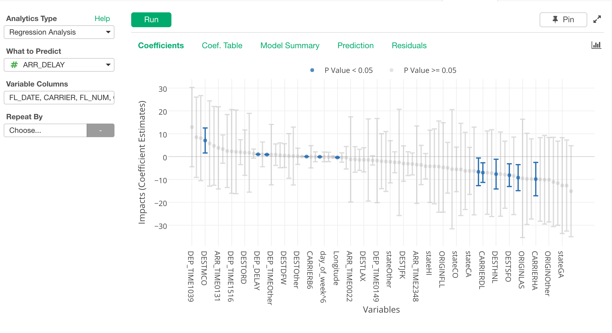
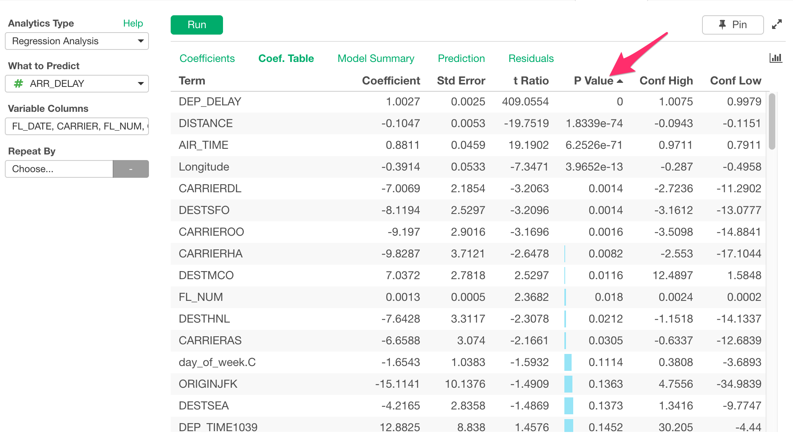
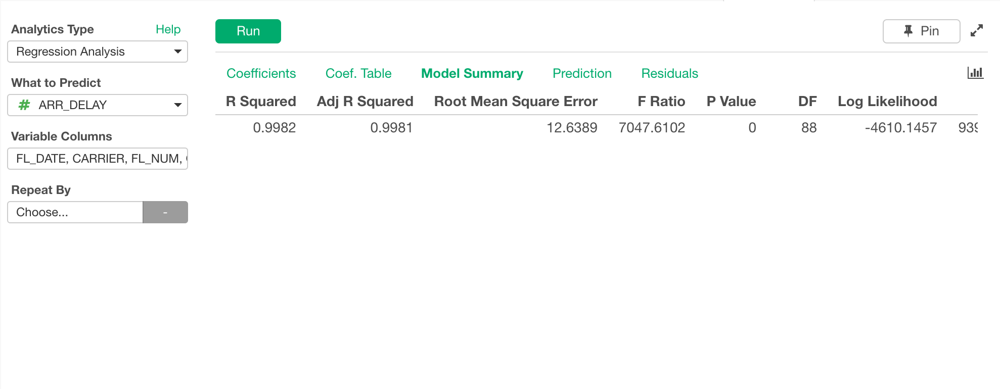
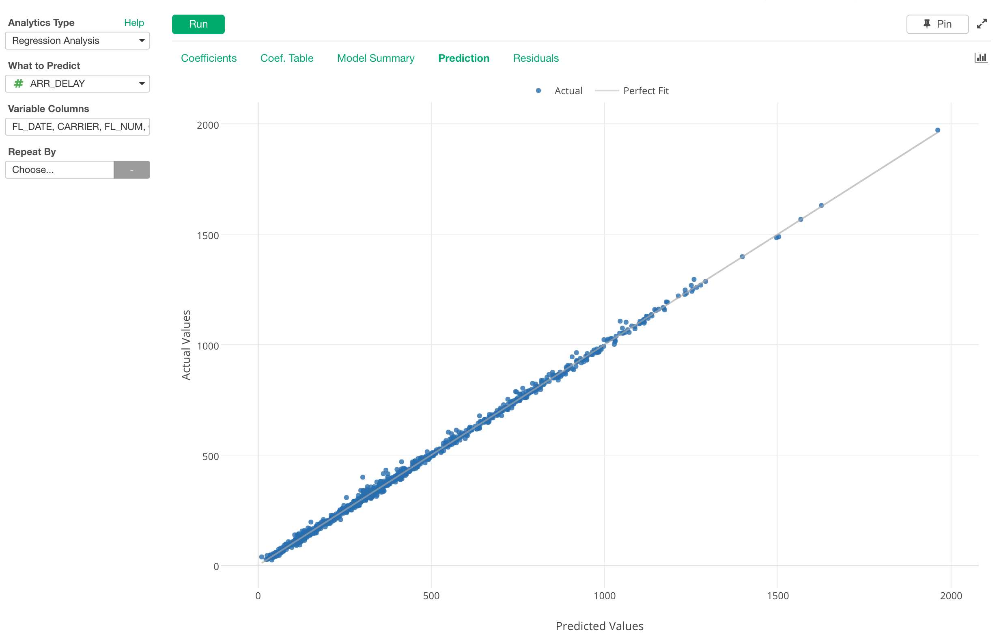
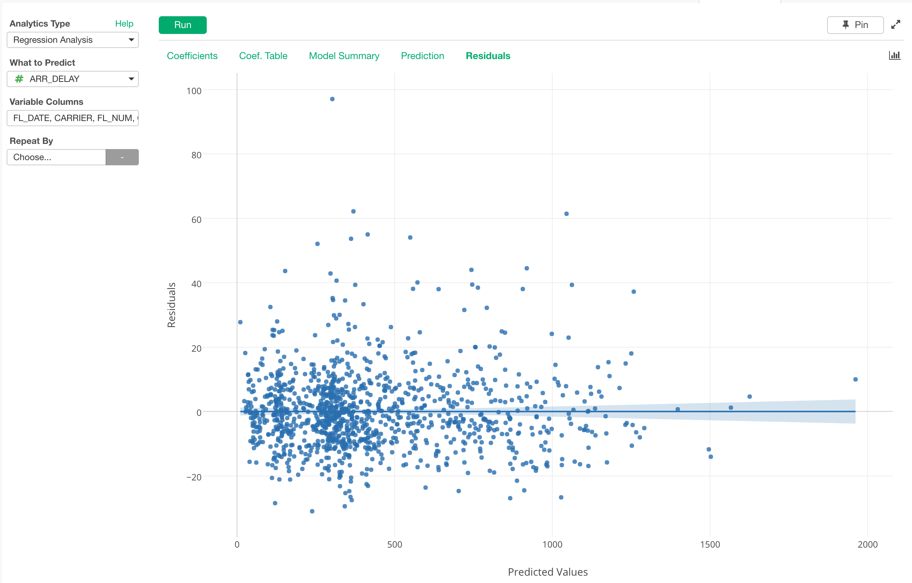

# Regression Analysis

Perform regression with lm.

## Input Data
Input data should contain at least one numeric column for "What to Predict" and more than one categorical and/or numeric columns as Variable Columns.

  * What to Predict - Numeric column that you want to Predict.
  
  * Variable Columns - Numeric and/or Categorical columns that you want to check importance to predict your "What to Predict" column.

## How to Use This Feature
1. Click Analytics View tab.
2. If necessary, click "+" button on the left of existing Analytics tabs, to create a new Analytics.
3. Select "Regression Analysis" for Analytics Type.
4. Select What to Predict Column.
5. Click Variable Columns and open Column Selector Dialog.

6. Select Columns that you want to see importance.
7. Click Run button to run the analytics.
8. Select view type (explained below) by clicking view type link to see each type of generated visualization.

### "Coefficients" View
"Coefficients" View displays coefficient estimates for all the predictor variables with Error Bars with P value as a color (i.e. If P Value < 0.05, the color is blue) 

### "Coefficients Table" View
"Coefficients Table" View displays more details for all the variables along with other metrics like Coefficient, Standard Error, t-Ratio, P-Value, etc. You can click on the column headers to sort the data with a help of bar visualization.

### "Model Summary" View
"Model Summary" View displays the summary of the model created for this Regression Analysis. Each column shows the model information like R Squared, Root Mean Square Error from where you can understand model performance.

- R Squared - A statistical measure of how close the data are to the fitted regression line. It is also known as the coefficient of determination, or the coefficient of multiple determination for multiple regression. 1 (100%) indicates that the model explains all the variability of the response data around its mean.

- Adjusted R Squared - The adjusted R-squared is a modified version of R-squared that has been adjusted for the number of predictors in the model. The adjusted R-squared increases only if the new term improves the model more than would be expected by chance. It decreases when a predictor improves the model by less than expected by chance. The adjusted R-squared can be negative, but it’s usually not.  It is always lower than the R-squared.

- Root Mean Square errors - The Root Mean Square Error (RMSE) (also called the root mean square deviation, RMSD) is a frequently used measure of the difference between values predicted by a model and the values actually observed from the environment that is being modeled.

- F Ratio - F Ratio gives you a measure of how much of the variation is explained by the model (per parameter) versus how much of the variation is unexplained (per remaining degrees of freedom). This unexplained variation is your error sums of squares. With this F Ratio, a higher ratio means that your model explains that much more of the variation per parameter than there is error per remaining degree of freedom.

### "Prediction" View
"Prediction" View compares the predicted values and the actual values to see how good or bad the model’s prediction capability is. If it is the perfect model, meaning it can predict with 100% accuracy, then all the dots should be lining up along with the gray line called ‘Perfect Fit’.

### "Residual" View
"Residual" View shows the residual which is difference between the predicted and the actual values. And visualizing the Residuals can reveal a lot of useful information that can guide you to decide what types of data transformations are needed to improve the model. (e.g. [Interpreting residual plots to improve your regression](http://docs.statwing.com/interpreting-residual-plots-to-improve-your-regression/))

## R Package

The `Regression Analysis` uses [`build_lm.fast`](https://github.com/exploratory-io/exploratory_func/blob/master/R/build_lm.R) function from Exploratory R Package under the hood.
