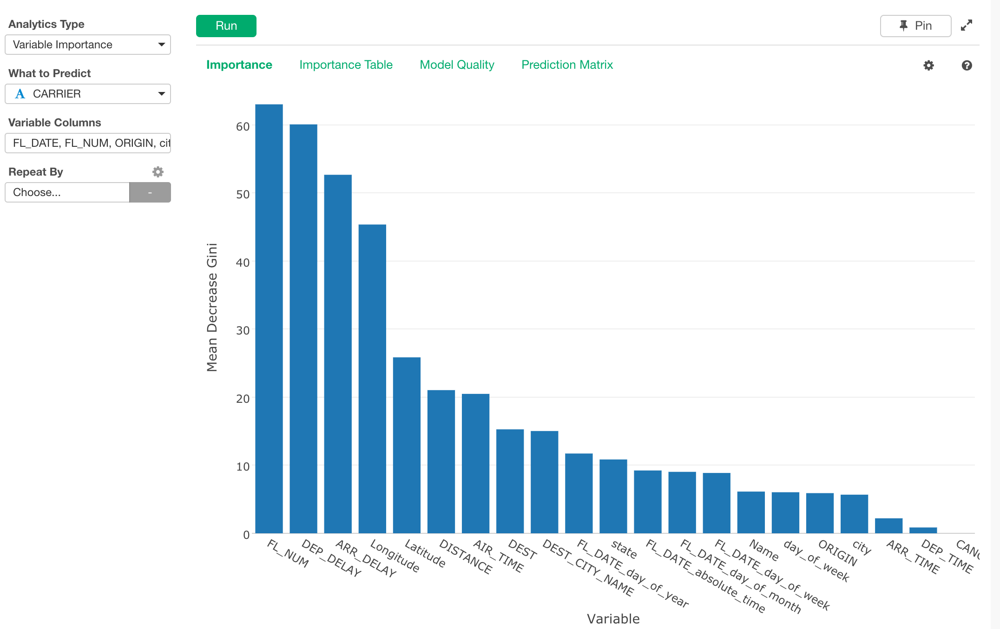
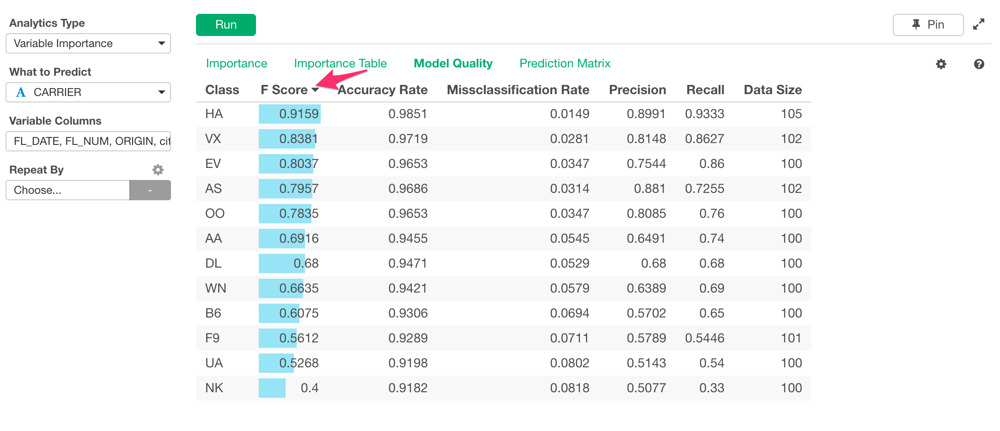
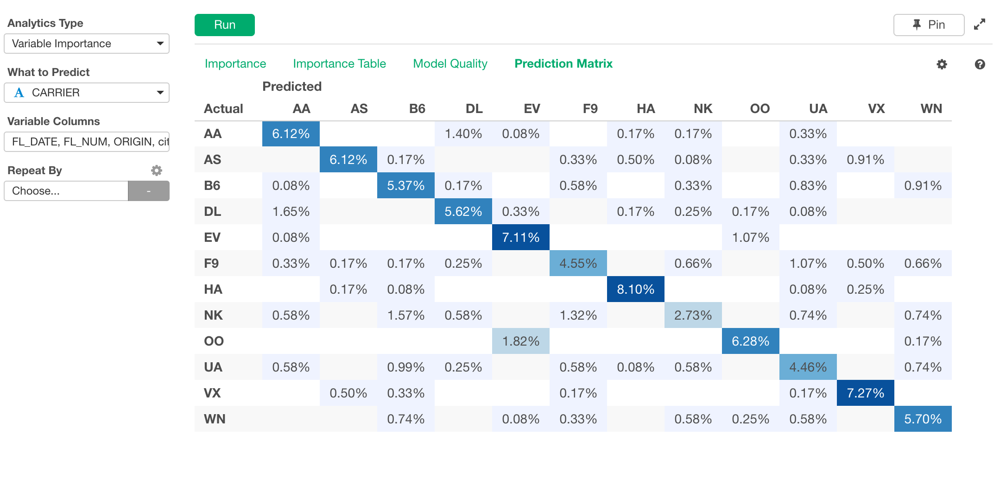

# Variable Importance

Calculates Variable Importance with Random Forest.

## Input Data
Input data should contain at least one categorical or numeric column for "What to Predict" and more than one categorical and/or numeric columns as Variable Columns.

  * What to Predict - Numeric or Categorical column that you want to Predict.
  
  * Variable Columns - Numeric and/or Categorical columns that you want to check importance to predict your "What to Predict" column.

## How to Use This Feature
1. Click Analytics View tab.
2. If necessary, click "+" button on the left of existing Analytics tabs, to create a new Analytics.
3. Select "Variable Importance" for Analytics Type.
4. Select What to Predict Column.
5. Click Variable Columns and open Column Selector Dialog.

6. Select Columns that you want to see importance.
7. Click Run button to run the analytics.
8. Select view type (explained below) by clicking view type link to see each type of generated visualization.

### "Importance" View
"Importance" View displays importance information on Bar chart with Mean Decrease Gini. The higher the Mean Decrease Gini, more important the variable is. 

### "Importance Table" View
"Importance Table" View displays the importance in table format with color as indicator of importance. By clicking column header for Importance, you can sort data.

### "Model Quality" View
"Model Quality" View displays the quality of the model created for this Variable Importance Analytics. Each row shows the model performance from the point whether the Class (i.e. Value in What to Predict column) prediction was correct or not if What to Predict is categorical column.

- F Score - A measure of Test Accuracy. The score ranges between 0 and 1 and Higher is better.  It's harmonic mean of precision and recall.
- Accuracy Rate - Another measure of Test Accuracy, which is calculated as `(Total True Positive + total True Negative) / Total Population.`
- Misclassification Rate - The rate the model fails to classify correctly. (i.e. 1 - Accuracy Rate)
- Precision - (also called positive predictive value) is the fraction of relevant instances among the retrieved instances.
- Recall -  (also known as sensitivity) is the fraction of relevant instances that have been retrieved over the total amount of relevant instances.

If the What to Predict column is numeric column, you will see

- Root Mean Square errors - The Root Mean Square Error (RMSE) (also called the root mean square deviation, RMSD) is a frequently used measure of the difference between values predicted by a model and the values actually observed from the environment that is being modeled.

- R Squared - A statistical measure of how close the data are to the fitted regression line. It is also known as the coefficient of determination, or the coefficient of multiple determination for multiple regression. 1 (100%) indicates that the model explains all the variability of the response data around its mean.

### "Prediction Matrix" View
"Prediction Matrix" View displays a matrix where each column represents the instances in a predicted class while each row represents the instances in an actual class. It makes it easy to see how well the model is classifying the two classes. The darker the color, the higher the percentage value.

## R Package

The `Variable Importance` uses [`randomForest`](https://cran.r-project.org/web/packages/randomForest/index.html) R Package under the hood.

## Exploratory R Package

For details about `randomForest` usage in Exploratory R Package, please refer the [github repository](https://github.com/exploratory-io/exploratory_func/blob/master/R/randomForest_tidiers.R)
