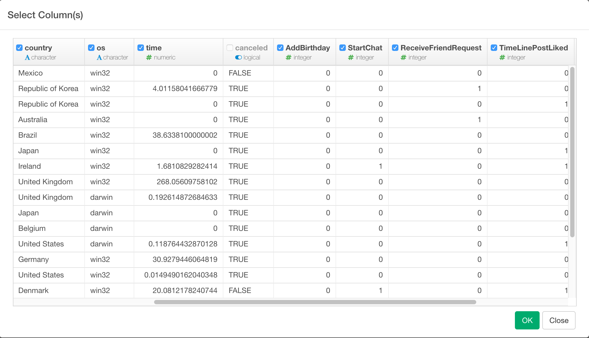
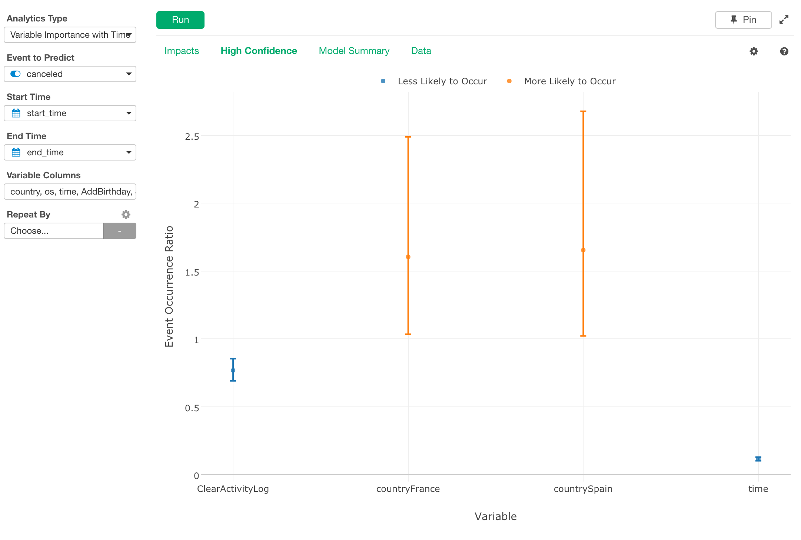
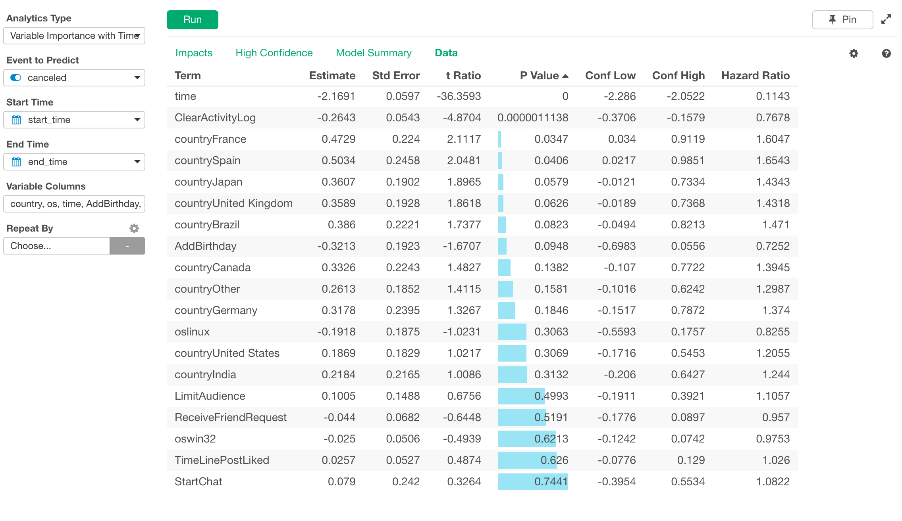

# Variable Importance with Time.

Calculates Importance (i.e. Proportional Hazard) for each variable with Cox Regression model.

## Input Data
Input data should be a survival data. Each row should represent one observation (e.g. one user of a subscription service). It should have following columns.

* Start Time - A Date or POSIXct column with the beginning of the observation of the subject.
* End Time - A Date or POSIXct column with the end of the observation of the subject.
* Event Status - A boolean or binary numeric value (can take value of 1 or 0) column with whether the event of interest (death) happened. When this column is true or 1, it means the event of interest happened to the subject at the End Time. If it is false or 0, it means we know that the event had not happened to the subject at least until the End Time, but we don't know what happened or will happen to the subject after that point.
* Variables Columns - Variables that you want to see Importance (i.e. Proportional Hazard)

## How to Use This Feature
1. Click Analytics View tab.
2. If necessary, click "+" button on the left of existing Analytics tabs, to create a new Analytics.
3. Select Start Time column with "Start Time" column selector.
4. Select End Time column with "End Time" column selector.
5. Select unit of time (Day, Week...) with "Period By" dropdown.
6. Select Event Status column with "Event Status" column selector.
7. Select Variable Columns with Column Selector Dialog.

6. Select Columns that you want to see importance.
7. Click Run button to run the analytics.
8. Select view type (explained below) by clicking view type link to see each type of generated visualization.

### "Impact" View
"Importance" View displays parameter estimate and confidence interval information on scatter plot. Blue means "Less Likely to Occur" and Orange means "More Likely to Occur". 

### "High Confidence" View
"High Confidence" View displays the variables whose both confidence interval edges are more than 1 (or less than 1). With this threshold, we can see only variables that have clear impact on the event.

### "Model Summary" View
"Model Summary" View displays the quality of the Cox regression model created for this Variable Importance with Time Analytics. 

- Likelihood Ratio Test - This value tells how well the model explains the data. The bigger is better. 
- Likelihood Ratio Test P Value - If the value is small enough (for example 005), we can assume that it's better to consider the variable instead of ignoring it.

### "Data" View
"Data" View displays parameter details.

- Term - Variable name
- Hazard Ratio - Variable's Proportional Hazard. (it shows how many times will Hazard become when the value of the parameter increased by 1)
- Estimate - Log scale (Natural logarithm) of Hazard Ratio. If the value is greater than 0 (zero), it means there is an influence that the event tends to occur easily.
- Conf Low - Lower limit of Confidence Interval.
- Conf High - Higher limit of Confidence Interval. 

## R Package

The `Variable Importance with Time` uses [`survival`](https://cran.r-project.org/web/packages/survival/index.html) R Package under the hood.

## Exploratory R Package

For details about `survival` usage in Exploratory R Package, please refer to the [github repository](https://github.com/exploratory-io/exploratory_func/blob/master/R/build_coxph.R)
