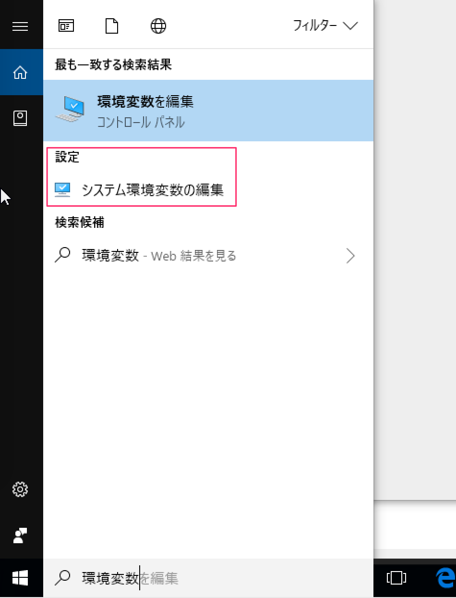
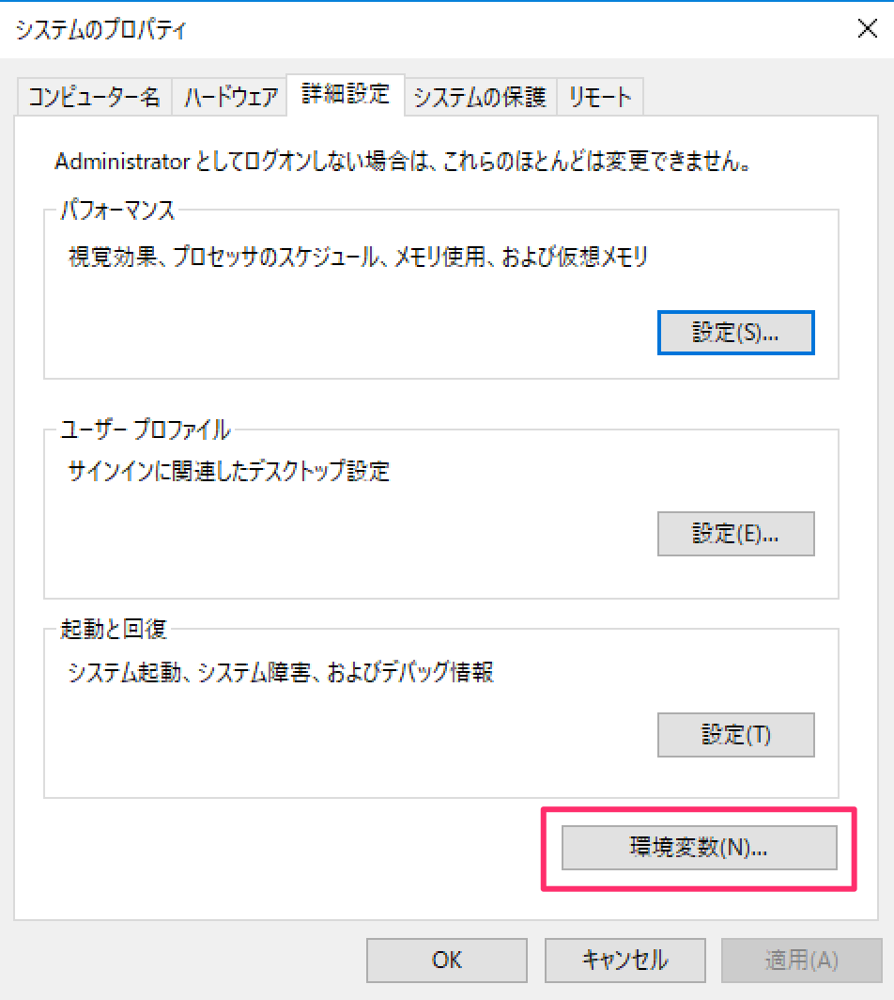
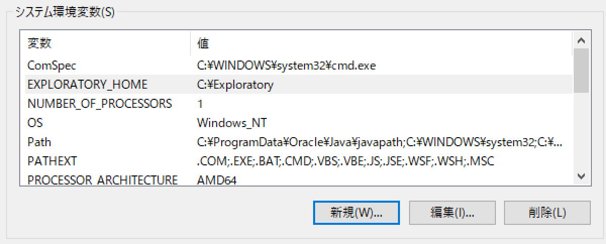

# レポジトリの場所の変更

Exploratoryは、ユーザーのホームディレクトリの下の .exploratory ディレクトリの中に、レポジトリを作成します。
.exploratoryディレクトリは、インストール時に作成されますが、ホームディレクトリの名前が空白やマルチバイト文字を含む場合には、作成に失敗することがあります。
ホームディレクトリの名前が空白やマルチバイト文字を含むことが原因でインストールに失敗しているときには、他の空白やマルチバイト文字を含まないディレクトリを
リポジトリ用ディレクトリとして指定することによって問題を回避できます。
EXPLORATORY_HOME環境変数を設定することによって、ホームディレクトリの下の .exploratory ディレクトリの代わりに、指定されたディレクトリがレポジトリとして使用されるようになります。

## WindowsでEXPLORATORY_HOMEを設定する方法

1. レポジトリ用の新規のディレクトリを作成します。ここでは例として"C:\exploratory"を作ってみます。

2. ウィンドウズの検索ボックスで"環境"と入力します。すると、検索結果に"システム環境変数の編集"が出てくるので、これをクリックしてオープンします。

  

3. "システムのプロパティ"ダイアログが開きます。

  

  環境変数ボタンをクリック。

4. "環境変数"ダイアログが開きます。

  

4. システム環境変数のセクションで"新規(W)..."をクリックして新規に環境変数を作成します。

  

5. 変数名に"EXPLORATORY_HOME"を設定し、値に"C:\exploratory"を設定してOKをクリックします。

  

6. スクリーンショットにあるように, EXPLORATORY_HOME 変数がセットされました。

7. Logout from Windows, and Log back in.

8. Install Exploratory by clicking Exploratory.exe. As Exploratory is installed, it uses "C:\exploratory" directory instead of .exploratory directory under home directory.

## Steps to set up EXPLORATORY_HOME environment variable on Mac

1. Open a shell and create a new directory for repository. Let's say we create "/exploratory" here as an example.
```
sudo mkdir /exploratory
```

2. Set ownership of the directory so that Exploratory run by you can read/write in the directory. Let's say your Mac OS username is john here.
```
sudo chown john /exploratory
```

3. Create `environment.plist` under `~/Library/LaunchAgents/` with the following content. (Replace "/exploratory" with the directory you are using for repository.)
```
<?xml version="1.0" encoding="UTF-8"?>
<!DOCTYPE plist PUBLIC "-//Apple//DTD PLIST 1.0//EN" "http://www.apple.com/DTDs/PropertyList-1.0.dtd">
<plist version="1.0">
<dict>
  <key>Label</key>
  <string>my.startup</string>
  <key>ProgramArguments</key>
  <array>
    <string>sh</string>
    <string>-c</string>
    <string>
    launchctl setenv EXPLORATORY_HOME /exploratory
    </string>
  </array>
  <key>RunAtLoad</key>
  <true/>
</dict>
</plist>
```

4. Logout and Log back in to your Mac OS. This will enable EXPLORATORY_HOME environment variable we set at the previous step.

5. Start Exploratory, and it will start using /exploratory as the repository.
