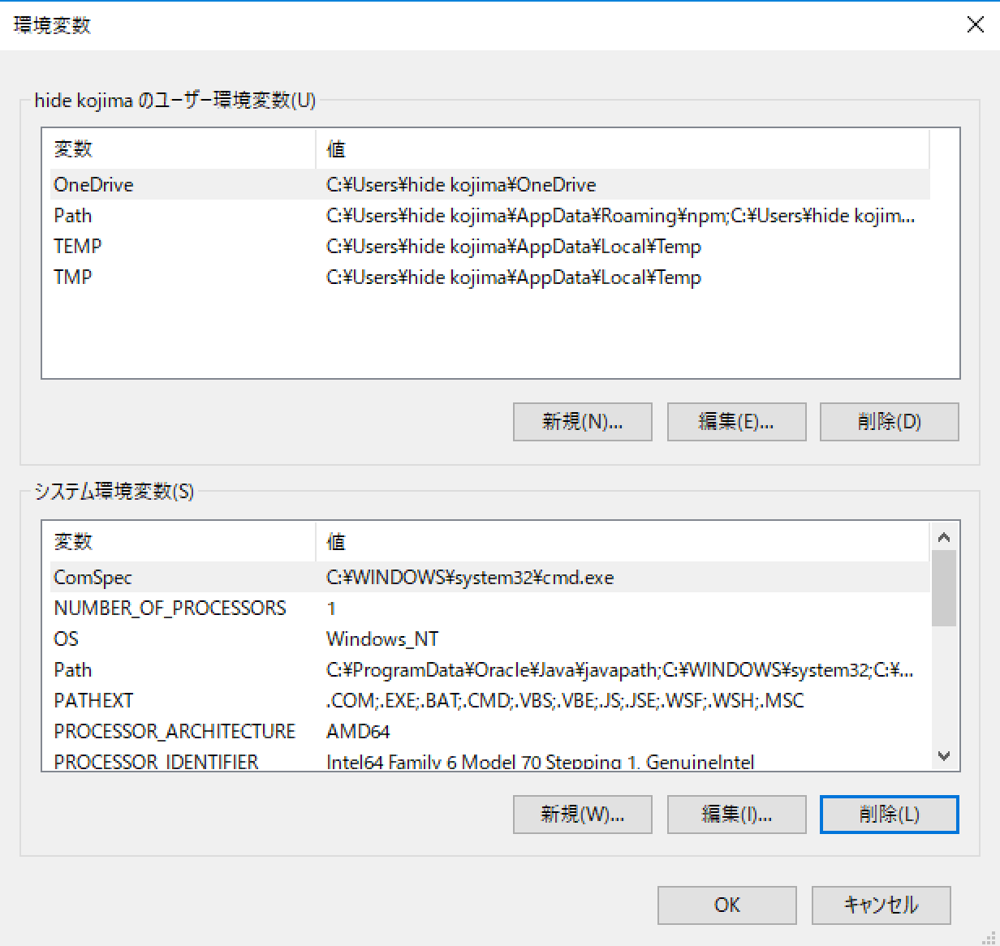

# レポジトリの場所の変更

Exploratoryは、ユーザーのホームディレクトリの下の .exploratory ディレクトリの中に、レポジトリを作成します。
.exploratoryディレクトリは、インストール時に作成されますが、ホームディレクトリの名前が空白やマルチバイト文字を含む場合には、作成に失敗することがあります。
ホームディレクトリの名前が空白やマルチバイト文字を含むことが原因でインストールに失敗しているときには、他の空白やマルチバイト文字を含まないディレクトリを
リポジトリ用ディレクトリとして指定することによって問題を回避できます。
EXPLORATORY_HOME環境変数を設定することによって、ホームディレクトリの下の .exploratory ディレクトリの代わりに、指定されたディレクトリがレポジトリとして使用されるようになります。

## WindowsでEXPLORATORY_HOMEを設定する方法

1. レポジトリ用の新規のディレクトリを作成します。ここでは例として"C:\exploratory"を作ってみます。

2. ウィンドウズの検索ボックスで"環境"と入力します。すると、検索結果に"システム環境変数の編集"が出てくるので、これをクリックしてオープンします。

  

3. "システムのプロパティ"ダイアログが開きます。

  

  環境変数ボタンをクリックします。

4. "環境変数"ダイアログが開きます。

  

4. システム環境変数のセクションで"新規(W)..."をクリックして新規に環境変数を作成します。

  

5. 変数名に"EXPLORATORY_HOME"を設定し、値に"C:\exploratory"を設定してOKをクリックします。

  

6. スクリーンショットにあるように, EXPLORATORY_HOME 変数がセットされました。

7. ウィンドウズから一旦ログアウトして、再度ログインし直します。.

8. Exploratory.exeをダブルクリックしてExploratoryデスクトップをインストールします。Exploratoryデスクトップがインストールされると、今度はホームディレクトリの下の.exploratoryではなく、先ほど指定した"C:\exploratory"がレポジトリの場所として使われるようになります。.

## MacでEXPLORATORY_HOME環境変数を設定する方法

1. ターミナルを起動し、レポジトリ用の新規のディレクトリを作成します。ここでは例として"/exploratory"を作成することにします。
```
sudo mkdir /exploratory
```

2. Exploratoryがそのディレクトに読み書きできるように、ディレクトの所有者を設定します。ここでは例としてMac OSのユーザー名がjohnであるとします。
```
sudo chown john /exploratory
```

3. `~/Library/LaunchAgents/` の下に `environment.plist` というファイルを以下の内容で作成します。("/exploratory" の部分を実際に使うディレクトリ名に置き換えてください。)
```
<?xml version="1.0" encoding="UTF-8"?>
<!DOCTYPE plist PUBLIC "-//Apple//DTD PLIST 1.0//EN" "http://www.apple.com/DTDs/PropertyList-1.0.dtd">
<plist version="1.0">
<dict>
  <key>Label</key>
  <string>my.startup</string>
  <key>ProgramArguments</key>
  <array>
    <string>sh</string>
    <string>-c</string>
    <string>
    launchctl setenv EXPLORATORY_HOME /exploratory
    </string>
  </array>
  <key>RunAtLoad</key>
  <true/>
</dict>
</plist>
```

4. 一旦Macからログアウトして、再度ログインします。これによって前のステップで定義したEXPLORATORY_HOME 環境変数が有効になります。

5. Exploratoryデスクトップを起動すると、"/exploratory"が新たにレポジトリとして使われるようになります。
