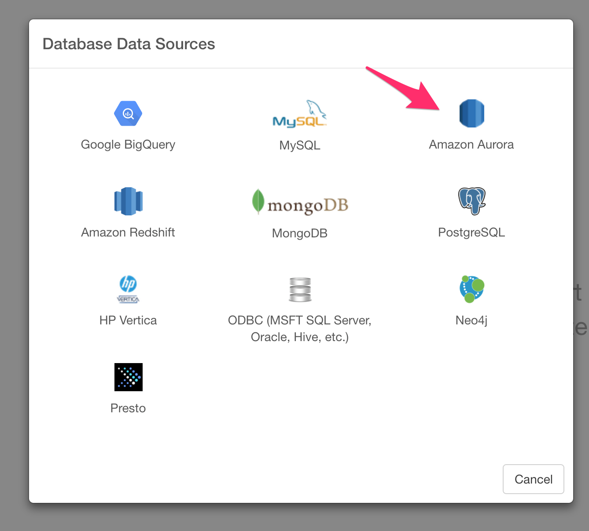

# Aurora Data Import

You can quickly import data from your Amazon Aurora Database into Exploratory.

## 1. AWS Security Group Setup

Make sure you added your client PC's IP address to your DB Security Group associated with the Aurora database instance.


## 2. Create a Connection to use

Create a connection following [this instruction](connection.html).

* Whether the connection is SSL or not is automatically detected.

## 3. Open Aurora Import dialog

Click '+' button next to 'Data Frames' and select 'Import Database Data'.


Click Amazon Aurora.



## 4. Preview and Import

1. Put data frame name.

2. Select connection from left box in the dialog.

3. Write a query in the input field.

4. Click "Preview" button. Then you will see the preview of the data.

5. Click "Save" button to import.


## 5. Using Variables in SQL

First, create a custom R script.


Second, define a variable in the R script and save.


```
cutoff_date <- "\'2016-01-15\'"
```

Note that the ‘\’ (backslash) symbols are used to escape the single quotes, which are required to be used for characters in SQL queries.

Finally, you can use @{} to surround a variable name inside the query like below.

```
select *
from airline_2016_01
where fl_date > @{cutoff_date}
```

Here's a [blog post](https://blog.exploratory.io/using-variables-in-sql-query-2740924d9f20#.bdcn5v68x) for more detail.
