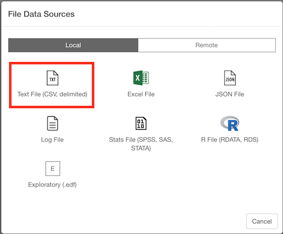
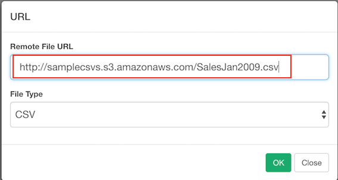

# Import CSV / Delimited File Data

You can import both local and remote CSV / Delimited File Data quickly.

## 1. Select CSV / Delimited File Data Menu

Click '+' button next to 'Data Frames' and select 'Import File Data'.

If you import CSV / Delimited File on your desktop or laptop, make sure Local tab is selected. If you import a file from remote server like Amazon S3, Dropbox, etc make sure Remote tab is selected. Click 'Text File (CSV, delimited)'

## 2. Select File.
If you select local, file picker shows up so select a file to import.
### 2.1 Local File

### 2.2 Remote File
if you select remote, small dialog shows up so enter a URL for the file.

## 3. Input parameters

Input parameters are same for local and remote file import.

Set these parameters.

* Encoding - File Encoding. By default, it shows best guessed encoding for you. you can manually select a correct one from pulldown list if default guessed encoding is not correct.
* Separator - Single character used to separate fields within a record.
* Decimal mark - Decimal mark used for numeric values in the CSV / Delimited File.
* Thousand mark - Thousand mark used in numeric vales in the CSV/ Delimited File
* Quote - Single character used to quote strings. Either double or Single
* Skip first N rows - Number of lines to skip before reading data.
* Treat these as NA - String(s) to use for missing values. Use comma(,) to enter multiple Strings. (e.g: N/A, Not Applicable)
* First Row as Header - Either TRUE or FALSE.
If TRUE, the first row of the input will be used as the column names, and will not be included in the data frame. If FALSE, column names will be generated automatically: X1, X2, X3 etc.
* Comment Character - A string used to identify comments. Any text after the comment characters will be silently ignored.
* Trim White Space - Should leading and trailing whitespace be trimmed from each field before parsing it?
* Column Types - you can override column type by passing column name and data type pair with ` columnName = '<type>'` syntax.
For Example, if `value` column is detected as integer but you want to import it as double, you can set `value = 'd'`. (d is for double). If you want to override multiple column types, you can do so by separating each pair with comma(,) like this. ` key = 'i', value = 'd'` 

Supported data types for overrides are:

- c (character)
- i (integer)
- n (number)
- d (double)
- l (logical)
- D (date)
- T (Date time)
- t (time)

## 4. Column Selection

On top of input parameters, you can also use checkboxes on the preview table to include/exclude columns. if you uncheck the checkboxes on the columns, these columns are excluded when you save the data. 

## 5. Preview and Import

Click Preview button to see the data in CSV / Delimited File. You can limit number of rows for the preview by selecting number from pulldown list on the preview table. If it looks ok, then you can click 'Import' to import the whole CSV / Delimited data into Exploratory.
