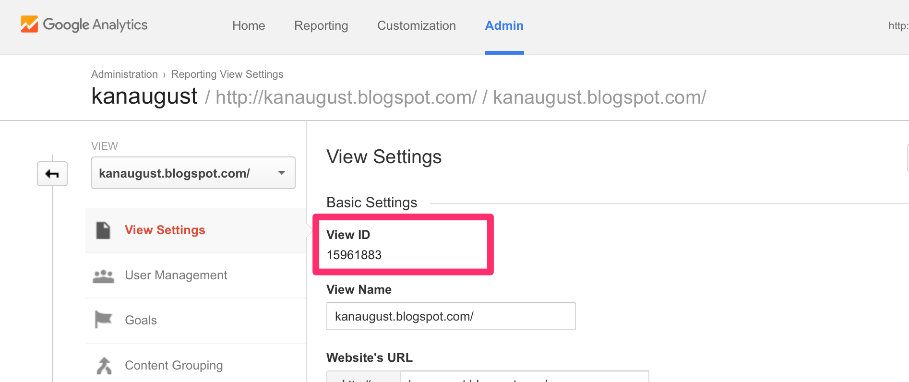

# Google Analytics Data

## 1. Select Google Analytics Data Menu

Click '+' button next to 'Data Frames' and select 'Import Cloud Apps Data'.

Click Google Analytics

## 2. OAuth Setting

Create a connection following [this instruction](https://blog.exploratory.io/how-to-setup-oauth-cloud-apps-connections-in-exploratory-a5c20d18e7c7).

## 3. Set Parameters

- Type a data frame name.
- Select View ID from the dropdown menu.
- Set Last N days. The default is set to 30, which means it will extract the last 30 days. You can update this based on your needs.
- Select Dimensions and Metrics from the dropdown menu.
- Set Paginate Query to Yes if the result is 10000 rows (max for one api access) and want to get more data.

## 4. Preview and Import

Click Preview button to see the data back from Google Analytics. If it looks ok, then you can click 'Import' to import the data into Exploratory.

## Appendix

### View ID

If you are not sure about the View ID you can find this information from Google Analytics page.

Go to [Google Analytics web page](https://analytics.google.com), and go to Admin page.

Go to View Setting for the view (web site) you're interested in.

Now you can find View ID.

You can select a list of Dimensions and Measures that you want to see data for from the dropdown list.

### Dimensions and Measures

You might want to take a look at [Query Parameter reference page](https://developers.google.com/analytics/devguides/reporting/core/v3/reference) for more detail on Dimension and Measures. Also, [Google Analytics Query Explorer tool page](https://ga-dev-tools.appspot.com/query-explorer/) is helpful for you to explore different parameters that Google Analytics support.
