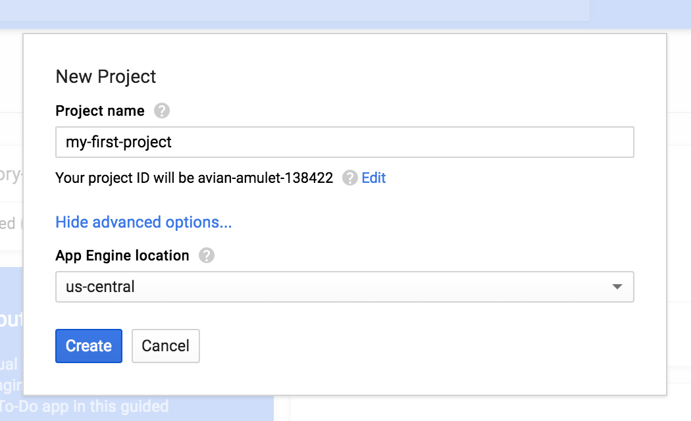
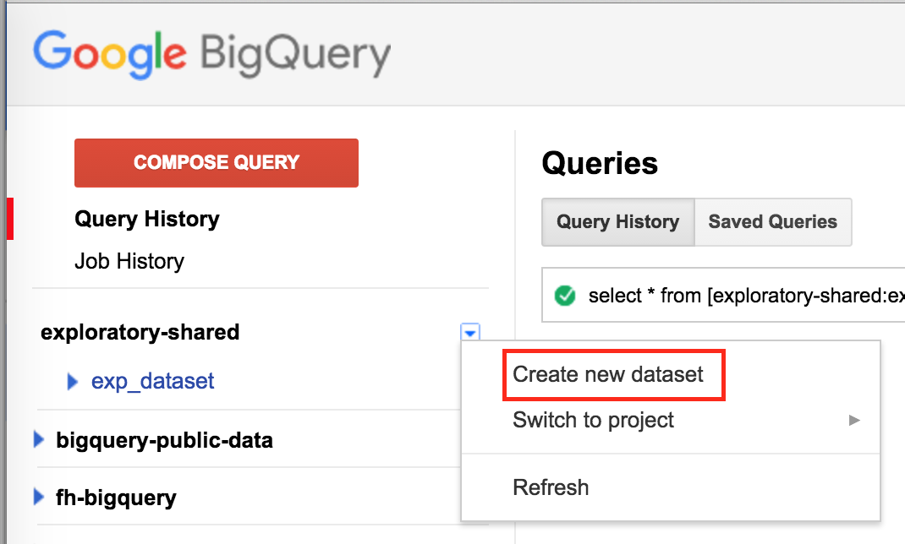
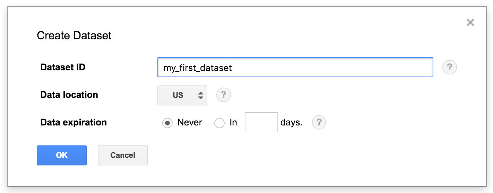
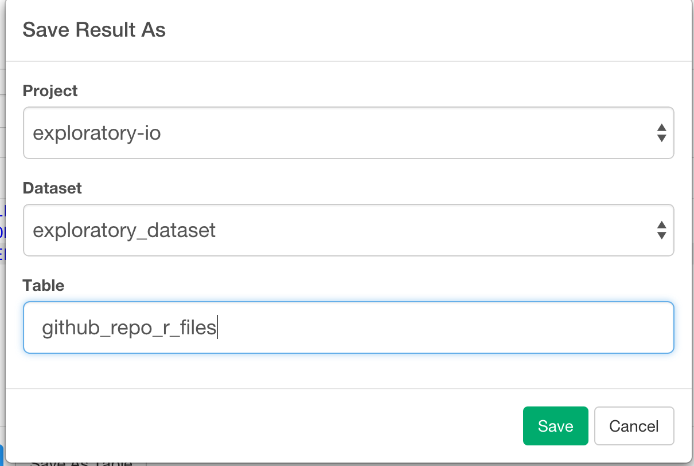

# Google BigQuery Data Import

## 1. Before you start

To use Google BigQuery with Exploratory Desktop, you need to create a project on Google Cloud Platform and a dataset on Google BigQuery.

### Create a project for Google BigQuery

- Open [Google Cloud Platform Console](https://console.cloud.google.com/)

- Click "Create Project" menu at the right hand side top

- Select a Project name and click "Create" button

- Make sure that you enable BigQuery API for you Project by clicking "Enable and manager APIs " menu under Use Google APIs section

### Create a dataset on Google BigQuery

- Open [Google BigQuery Web ui](https://bigquery.cloud.google.com/)

- Click down arrow icon next to your project name and select "Create new dataset" menu.

- Enter Dataset id and Click "OK" button

 

## 2. Select Google BigQuery Data Menu

- Select 'Import Remote Data' from Add Data Frames dropdown

- Click 'Google BigQuery'

## 3. Authentication with Google OAuth

Select an account you want to use for your Google BigQuery and click 'Allow' button to allow Exploratory to extract your Google BigQuery data based on the parameters you are going to set up in the next step.

## 4. Write SQL Query

### 4.1 Preview Data

- Type Data Frame Name

- Select Google BigQuery Project from the dropdown menu

- Enter query to SQL Query editor

- Click Run button to preview data.

### 4.2 Save query result as a new table on Google BigQuery 

If your query is against huge table, it’s probably a good idea to create a a new table containing just the data you want to use for further analysis to minimize the cost. To do this, after getting preview data click Save As Table button.

- Select Project from pulldown menu
- Select Dataset from pulldown menu
- Type new table name 
- Click Save button
 
Exploratory Desktop checks list of tables after you saved a table and once check is done, you can see newly created table on the tree

Once new table is created, you can query against the table.

## 5. Import

Click 'Import' button

If the data in the preview table look ok, then click 'Import' button to import the data into Exploratory.
