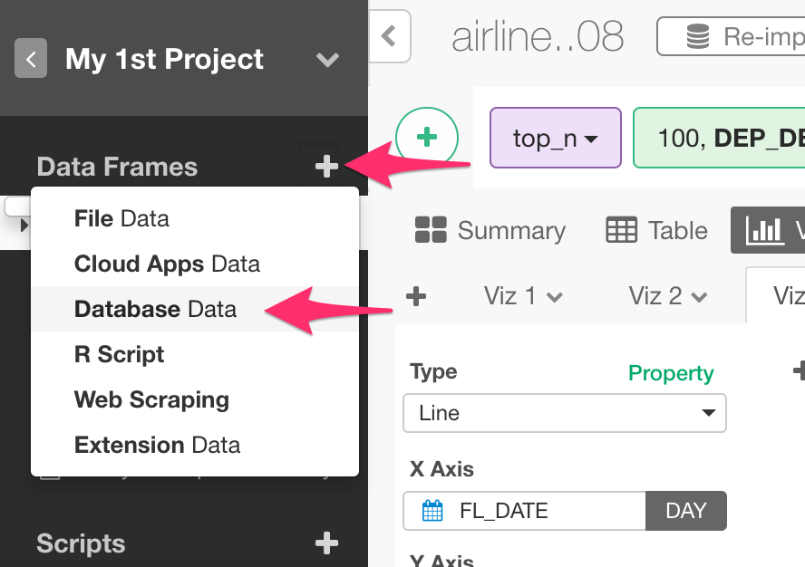
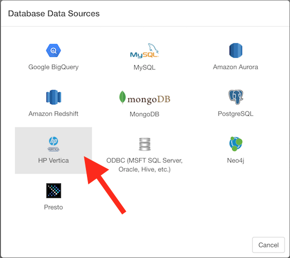
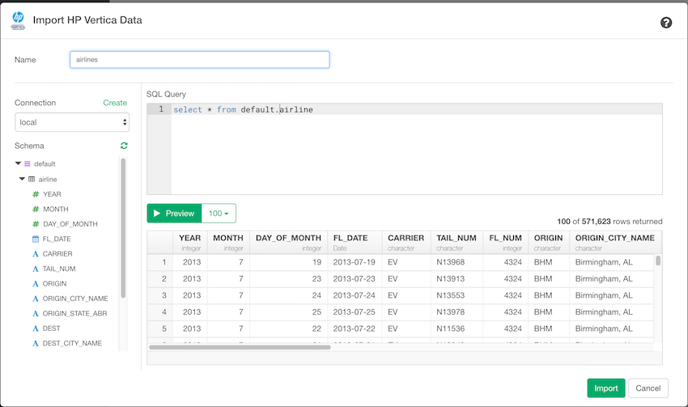

# HP Vertica Database Data Import

You can quickly import data from your HP Vertica Database into Exploratory.

## 1. Create a Connection to use

Create a connection following [this instruction](connection.html).

## 2. Open HP Vertica Import dialog

Click '+' button next to 'Data Frames' and select 'Import Database Data'.



Click HP Vertica to select.




## 3. Import

1. Put data frame name.

2. Select connection from left dialog box.

3. Write a query in the input field.

4. Click "Preview" button. Then you will see the preview of the data.

5. Click "Import" button.



If it looks ok, then you can click 'Import' to import the data into Exploratory.

## 4. Using Variables in SQL

First, create a custom R script.


Second, define a variable in the R script and save.


```
cutoff_date <- "\'2016-01-15\'"
```

Note that the ‘\’ (backslash) symbols are used to escape the single quotes, which are required to be used for characters in SQL queries.

Finally, you can use @{} to surround a variable name inside the query like below.

```
select *
from airline_2016_01
where fl_date > @{cutoff_date}
```

Here's a [blog post](https://blog.exploratory.io/using-variables-in-sql-query-2740924d9f20#.bdcn5v68x) for more detail.
