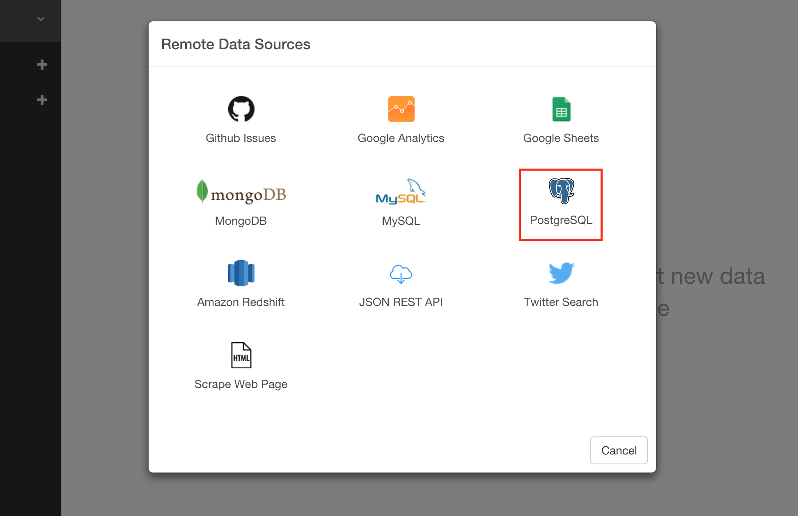
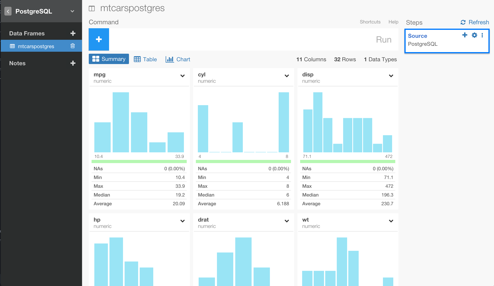
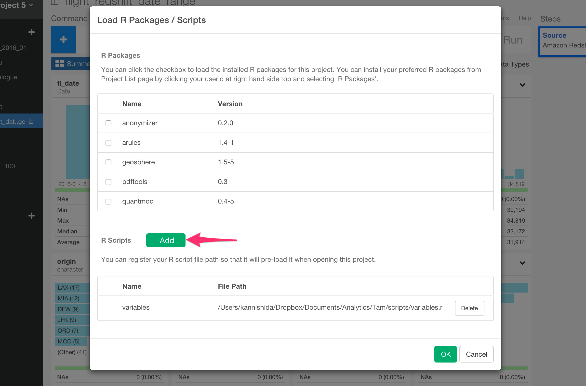

# PostgreSQL Database Data Import

You can quickly import data from your PostgreSQL Database into Exploratory.

## 1. Create a connection for Amazon Redshift database

First, you want to create a connection for Amazon Redshift database.


After filling the database information, click ‘Test Connection’ button to make sure the information is correct, before you save it.


## 2. Open PostgreSQL Import dialog

Select 'Import Remote Data' from Add New Data Frame menu.


Click PostgreSQL to select.




## 3. Preview and Import

Click Preview button to see the data back from your PostgreSQL db.



If it looks ok, then you can click 'Import' to import the data into Exploratory.

## 4. Using Variables in SQL

First, define a variable in R script file.

```
cutoff_date <- "\'2016-01-15\'"
```

Note that the ‘\’ (backslash) symbols are used to escape the single quotes, which are required to be used for characters in SQL queries.

Second, load the R script file.




Finally, you can use @{} to surround a variable name inside the query like below.

```
select *
from airline_2016_01
where fl_date > @{cutoff_date}
```

Here's a [blog post](https://blog.exploratory.io/using-variables-in-sql-query-2740924d9f20#.bdcn5v68x) for more detail.
