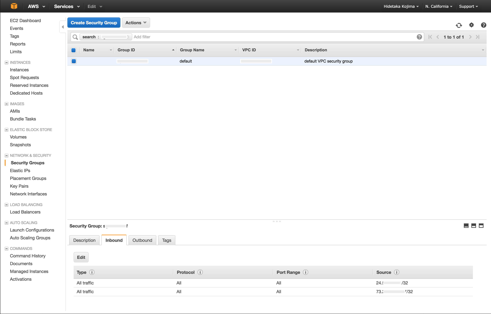

# Amazon Redshift Database Data Import

You can quickly import data from your Amazon Redshift Database into Exploratory.

## 1. Create a connection for Amazon Redshift database

First, you want to create a connection for Amazon Redshift database.


After filling the database information, click ‘Test Connection’ button to make sure the information is correct, before you save it.


## 2. Open Redshift Import dialog

Select 'Import Remote Data' from Add New Data Frame menu.


Click Redshift to select.


## 3. Preview and Import

Click Preview button to see the data back from your Redshift db.


If it looks ok, then you can click 'Import' to import the data into Exploratory.

## 4. Querying Random Sample Data

You might want to take a random sample of the data that would be reasonable size for your analysis.

You can use [md5](http://docs.aws.amazon.com/redshift/latest/dg/r_MD5.html) function to get random number generated and use it like below to get the random sample of the data.

```
SELECT *
   FROM airline_2016_01
   ORDER BY md5('randomSeed' || flight_num)
   LIMIT 100000
```

## 5. Using Variables in SQL

First, define a variable in R script file.

```
cutoff_date <- "\'2016-01-15\'"
```

Note that the ‘\’ (backslash) symbols are used to escape the single quotes, which are required to be used for characters in SQL queries.

Second, load the R script file.


Finally, you can use @{} to surround a variable name inside the query like below.

```
select *
from airline_2016_01
where fl_date > @{cutoff_date}
```


## 6. AWS Security Group Setup



If you encounter a database connection error, please go to AWS console and make sure you added your client PC's IP address to your Security Group (both Inbound and Outbound) associated with the Redshift cluster.
