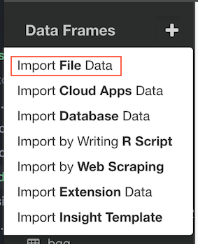
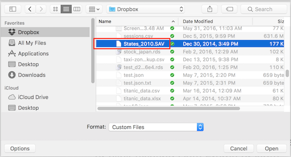
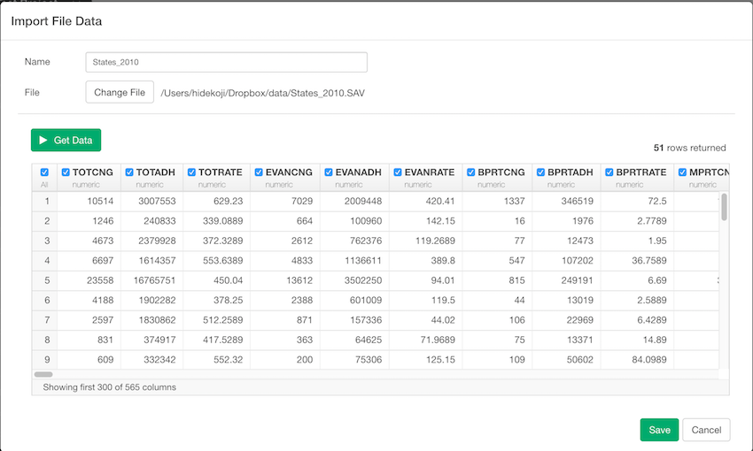

# Import Stats (SAS / SPSS / STAT) File Data

You can import both local and remote Stats (SAS / SPSS / STAT) File Data quickly.

## 1. Select Stats (SAS / SPSS / STAT) File Data Menu

Click '+' button next to 'Data Frames' and select 'Import File Data'.

If you import Stats (SAS / SPSS / STAT) File on your desktop or laptop, make sure Local tab is selected. If you import a file from remote server like Amazon S3, Dropbox, etc make sure Remote tab is selected. Click 'Text File (CSV, delimited)'

## 2. Select File.
If you select local, file picker shows up so select a file to import.
### 2.1 Local File

### 2.2 Remote File
if you select remote, small dialog shows up so enter a URL for the file. And select File Type from Pulldown list.

## 3. Input parameters

There is no parameter on the import dialog.

## 4. Preview and Import

Click Preview button to see the data in Stats (SAS / SPSS / STAT) File. You can limit number of rows for the preview by selecting number from pulldown list on the preview table. If it looks ok, then you can click 'Import' to import the whole Stats (SAS / SPSS / STAT) data into Exploratory.
