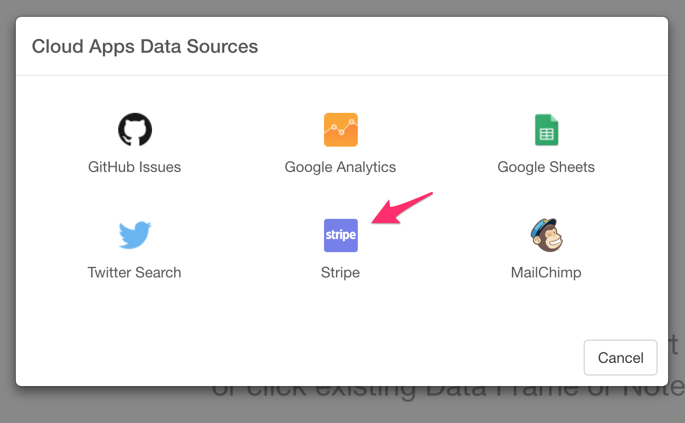

# Import Stripe API Data

You can get your payment data from Stripe quickly. Take a look at this [blog post](https://blog.exploratory.io/importing-stripe-payment-data-visualize-and-schedule-with-exploratory-3b1422a9cf8b) for the details.

## 1. Select Stripe Data Menu

Click '+' button next to 'Data Frames' and select 'Import Cloud Apps Data'.

Click 'Stripe'

## 2. OAuth Setting

Create a connection following [this instruction](https://blog.exploratory.io/how-to-setup-oauth-cloud-apps-connections-in-exploratory-a5c20d18e7c7).

# 3. Input parameters

Set these parameters.

* Data Type - Select a type of Stripe data set.
  * Balance History - Returns a list of transactions that have contributed to the Stripe account balance (e.g., charges, transfers, and so forth).
  * Charges - Returns a list of charges you’ve previously created.
  * Customers - Returns a list of your customers.
  * Disputes - Returns a list of your disputes. A dispute occurs when a customer questions your charge with their bank or credit card company. When a customer disputes your charge, you're given the opportunity to respond to the dispute with evidence that shows the charge is legitimate.
  * Events - List events, going back up to 30 days. A new Event data is created when an interesting event occurs. For example, when a charge succeeds, a charge.succeeded event is created.
  * File Uploads - Returns a list of the files that you have uploaded to Stripe.
  * Payouts - Returns a list of existing payouts sent to third-party bank accounts or that Stripe has sent you. A payout data is created when you receive funds from Stripe or you initiate a payout to either a bank account or debit card of a connected Stripe account.
  * Refunds - Returns a list of all refunds you’ve previously created.
  * Transfers - Returns a list of existing transfers sent to connected accounts. A transfer data is created when you move funds between Stripe accounts as part of connect.
  * Subscriptions - Returns a list of subscriptions that have not been canceled. Subscriptions allow you to charge a customer's card on a recurring basis. A subscription ties a customer to a particular plan you've created.
* Date Range - Select a type of date filtering. If you choose 'After This Date', you can indicate explicit date like '2015-11-03' in 'Value for Date Range'. If you choose 'Last N ~', you can indicate a positive integer in 'Value for Date Range' and the data is filtered by the number with the time unit in the option.
* Value for Date Range - If this is empty, all data is imported. If 'Date Range' is 'After This Date', this should be explicit date like '2015-11-03'. If 'Date Range' is 'Last N ~', this should be a positive integer.

## 4. Preview and Import

Click Preview button to see the data back from Stripe. If it looks ok, then you can click 'Import' to import the data into Exploratory.
