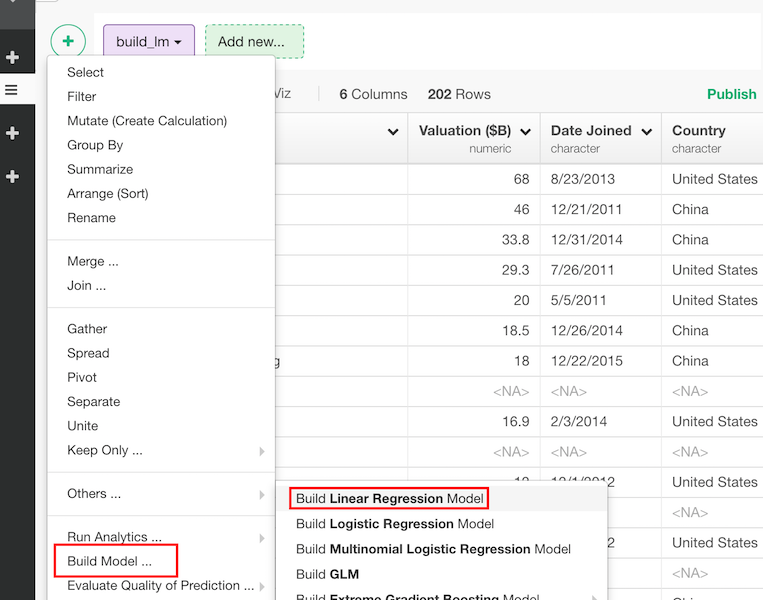
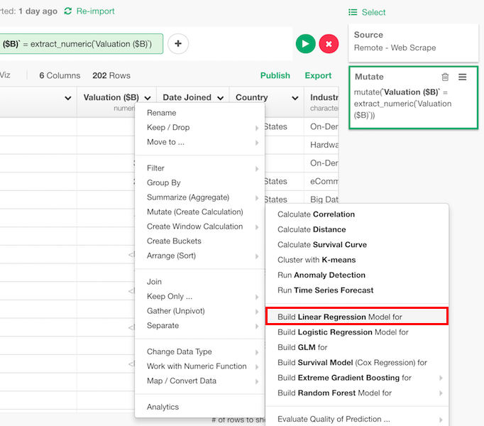
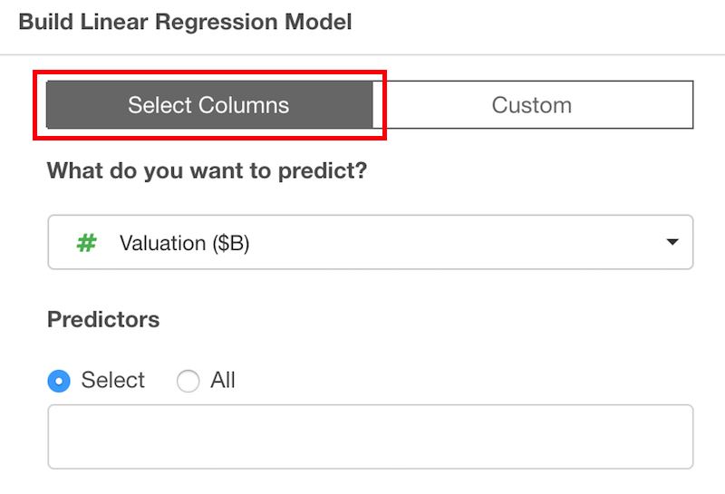

# Linear Regression Model

## Introduction

Linear regression model is a statistical model with an assumption that linear relationships are there between explanatory variable and predictor variables.

## How to Access?

There are two ways to access. One is to access from 'Add' (Plus) button.

Another way is to access from a column header menu from a numeric column.

## How to Use?

### Column Selection

There are two ways to set what you want to predict by what variables.

If you are on "Select Columns" tab, you can set them by column selector.

If you are on "Custom" tab, you can type a formula directly.

### Train Test Split

You can split the data into training and test to evaluate the performance of the model. You can set

* Test Data Set Ratio - Ratio of test data in the whole data.
* Random Seed to Split Training/Test - You can change random seed to try other training and test data combination.

### Parameters

* A Vector to Subset Data (Optional) - "subset" parameter of lm function.
* Weight Vector (Optional) - "weights" parameter of lm function.
* How to treat NA? (Optional) - "na.action" parameter of lm. function. The default is "na.fail". This changes the behaviour of NA data. Can be one of the following.
  * "na.omit"
  * "na.fail"
  * "na.exclude"
  * "na.pass"
  * NULL
* Which method to apply? (Optional) - "method" parameter of lm function. The default is "qr". The method to be used in fitting the model. This can be
  * "qr"
  * "model.frame"
* Return Model Ojbect (Optional) - "model" parameter of lm function.
* Return Model Matrix X (Optional) - "x" parameter of lm function.
* Return Model Matrix Y (Optional) - "y" parameter of lm function.
* Return QR Decomposition (Optional) -  "qr" parameter of lm function. The default is TRUE. If qr should be returned.
* Allow Singular Fit -  "singular.ok" of lm parameter of lm function. The default is TRUE. Whether only one observation fitting should be accepted.
* Offset (Optional) - "offset" of lm parameter of lm function. Already known components for linear predictors during fitting.

Take a look at the [reference document](https://stat.ethz.ch/R-manual/R-devel/library/stats/html/lm.html) for the 'lm' function from base R for more details on the parameters.

## Step-by-step

Here's a step-by-step tutorial guide on how you can build, predict and evaluate linear regression model.

* [Introduction to Linear Regression Model in Exploratory](https://blog.exploratory.io/introduction-to-linear-regression-model-in-exploratory-a46e90d62f7d)
