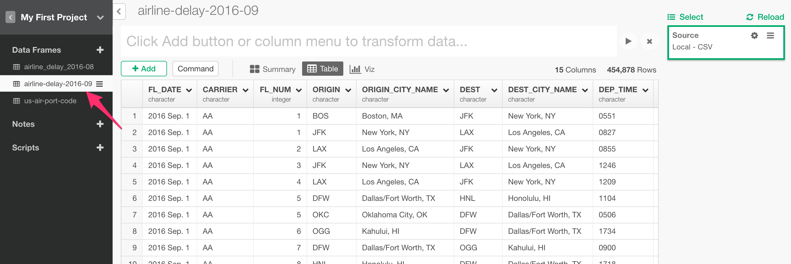
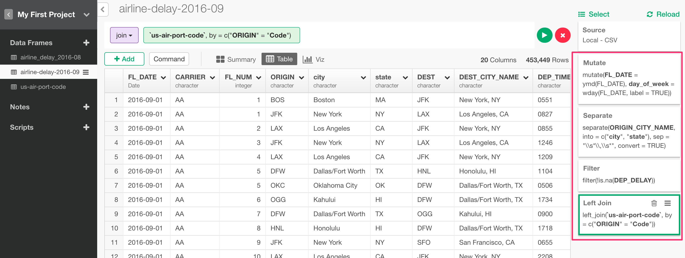

## 分析作業を再現する

今度は、9月の翌月の新しい飛行遅延データセットを受け取ったばかりで、前に行ったのと同じデータ変換と解析を実行したいとします。これを行うには2つの簡単な方法があります。

1.データフレームを複製しソースデータを入れ替える

2.データフレームから別のデータフレームへステップをコピーする

この演習では、まず、このリンクから9月のデータセットをダウンロードしてください。

* [Flight delay 2016 September data](http://download2.exploratory.io/data/airline-delay-2016-09.csv)

そして以下が手順です。

### 1. データフレームを複製しソースデータを入れ替える

これを行う最も簡単な方法は、現在のデータフレームを複製し、別の名前で保存することです。

「Vizを含む」チェックボックスをオンにして、すべてのチャートをコピーし、データフレーム名を入力します。

コピーが完了したら、新しいデータフレームに移動し、「歯車」アイコンをクリックしてデータソースを切り替えます。

「ファイルの変更」ボタンをクリックし、上記のCSVファイル 「airline_delay-2016-09.csv」を選択し、下部にある[更新]ボタンをクリックします

すべてのデータ変換ステップがこの新しいデータセットに自動的に適用されることがわかります。 Vizタブに移動すると、9月のデータと同じグラフ設定が表示されます。今月は、「F9」が他のものよりもずっと大きな出発遅延時間を積み上げた航空会社であることがわかります！

このオプションの利点は、データ・ラングリングのステップだけでなく、データフレーム内のすべてのチャートも保持できることです。このオプションの欠点は、すべてのステップとブランチを一緒にコピーすることになるため、複製後にクリーンアップする必要があることです。そして、これがあなたが次の選択肢を検討したい理由です。

### 2. データフレームから別のデータフレームへステップをコピーする

上記のCSVファイルを新しいデータフレームとしてインポートします。

元のデータフレーム「airline_delay_2016-08」に戻り、右側のステップの上部にある「選択」ボタンをクリックします。

コピーするステップを選択します。下の図では、「Mutate」ステップから「Left Join」のステップまでのみコピーしていますが、すべてのステップもコピーできます。「アクション」ボタンのドロップダウンリストから「コピーステップ」を選択します。

その後、新しいデータフレーム 「airline_delay_2016-09」に戻ります。

右側の「ソース」ステップのアクションメニューから「ペーストステップ」を選択します。

これにより、これらのコピーされたステップがこのデータフレームに追加され、すべてのデータ変換操作が適用されたデータが取得されます。

とてもシンプルですね！
