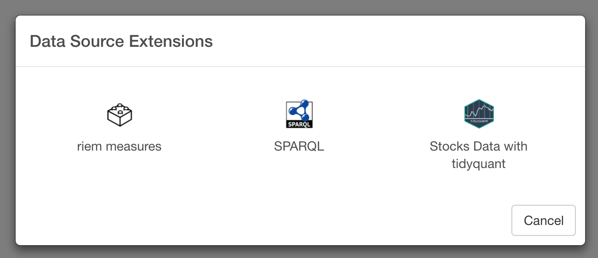
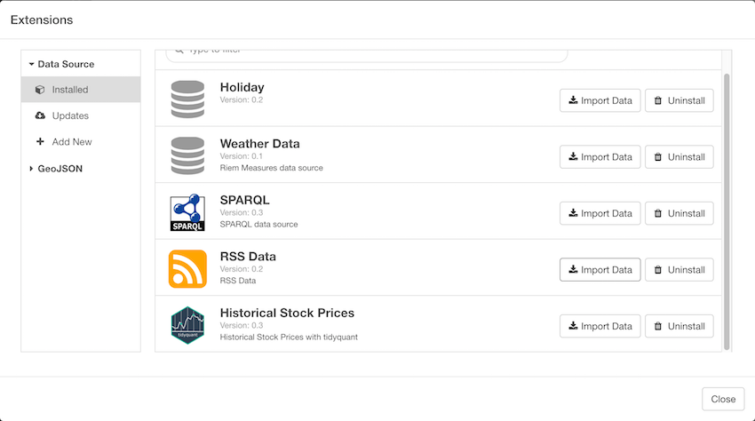
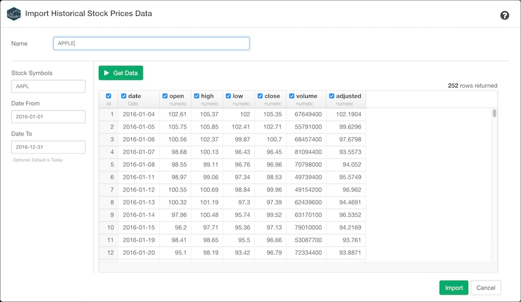

# Add your Custom Data Sources with Data Source Extension Framework

Exploratory provides a framework with which developers can create their own data sources that can be invoked from Exploratory's Data Import Dialog.

## Data Source Extension Structure

A user-defined data source extension consists of JSON format extension definition meta file (`extension.json`) and R script file (`extension.r`).
These two files need to be stored inside `~/.exploratory/extensions/datasources/` directory as follows.

`~/.exploratory/extensions/datasources/<extension_name>/extension.json`

`~/.exploratory/extensions/datasources/<extension_name>/scripts/extension.r`
 

## Create Data Source Extension directory

So let's say you want to create a data source extension that uses `riem_measures` function from [riem](https://github.com/ropensci/riem) R package to get ASOS data via the Iowa Environment Mesonet. Then first you want to to create a directory called `my_riem_measures`. NOTE: The directory name is the data source extension name and should be unique among user-defined data source extensions.

So on Mac, you can do:

`$ cd ~/.exploratory/extensions/datasources`

`$ mkdir my_riem_measures`

## Create Data Source Extension Definition Meta File.

This is how your Data Source Extension Definition Meta File (`extension.json`) looks like. The file must be in valid JSON format.

```
{
  "name": "my_riem_measures",
  "displayName": "riem measures",
  "iconURL" : "lib/images/plugin.png",
  "helpURL" :  "http://ropensci.github.io/riem/",
  "packages": [{"name": "riem", "version" : "0.1.1"}],
  "function": "riem_measures",
  "rSourceFile" : "extension.r",
  "hasQueryField" : false,
  "version" : "0,1",
  "inputParameters": [
    {
      "name": "station",
      "displayName":"Station",
      "dataType": "text",
      "defaultValue" : "",
      "required" : true
    },
    {
      "name": "date_start",
      "displayName":"Date Start",
      "dataType": "text",
      "defaultValue" : "",
      "required" : true
    },
    {
      "name": "date_end",
      "displayName":"Date End",
      "dataType": "text",
      "defaultValue" : "",
      "required" : true
    }
  ]
}
```

### Attributes

#### name (required)

`name` attribute holds Name of the data source extension. in this case `my_riem_measures`, please make sure to use your directory name for this `name` attribute. 

#### displayName (required)

`displayName` attribute is used for Display Name on Data Source Extension Picker Dialog and Import Data Dialog.

#### iconURL (required)

`iconURL` holds icon image file URL for your data source extension. currently it only supports external URL.

For example:
 
```
   "iconURL" : "http://xmllondon.com/images/sparqlThumb.png",
```

If you do not have an icon default icon is used instead.

If you use external URL, `iconWidth` and `iconHeight` are set to 32px by default to fit icon in the UI. If you want to change it for some reason, you can change these by specifying following attributes.

```
"iconWidth" : "64px",
"iconHeight" : "32px"
```

#### helpURL (required)

`helpURL` holds URL for your data source extension help page. Help Link is put on Import Dialog Header.
If you do not have one, you can set default exploratory doc link like below:

```
"helpURL" :  "http://docs.exploratory.io/",
```

#### packages (optional)

`packages` is an array of package name and version pairs that the data source extension depends. For example, if you data source extension depends on `riem` you need to set it like below: 

```
"rPackageDependencies": [{"name" : "riem", "version" : "0.1.1"}],
```

#### function (required)

`function` holds R function name that the data source extension calls to get data. The R function must return a data frame as output. In this example, you'll call `riem_measures` from riem package.

#### rSourceFile (required)

`rSourceFile` holds the name of R script file that the data source extension depends. Let's use `extension.r` for this example.

#### hasQueryField (optional)

If you want to have a dedicated query input field that has much space for your query string, Set `hasQueryField` as `true` and add a parameter whose `name` is `query` and `dataType` is text.

For example, if you define following in your `extension.json`

``` 
"hasQueryField" : true,
"inputParameters": [
  {
    "name" : "query",
    "displayName":"Query",
    "dataType":"text",
    "defaultValue" : "",
    "required" : true
  },
```
then you can have dedicated query input field on right hand side of the import Dialog.


#### version (required)

Version of your data source extension.

### inputParameters

`inputParameters` is an array of parameters passed to the `function` (i.e in this case, `riem_measures`) and these are rendered as input fields on Data Import Dialog. Parameters order matters so make sure to set input parameters in a way that underlying R function expects. For example, if your R function has arguments station, start_date, and end_date then you need to define your inputParameters in this order.(i.e station, start_date, and end_date). If you want to define parameter order in a different way, you need to write wrapper function in library.r file and then do a parameter mapping there like below and set the wrapper function name (`riem_measures_wrapper`) to `function` attribute.

```
riem_measures_wrapper <- function(start_date, end_date, station){
  riem_measures(station = station, start_date = start_date, end_date = end_date)  
}
```

 Each parameter can have following Attributes

- name
- displayName
- colSpan
- dataType
- showLabel
- defaultValue
- required

#### name (required)

`name` of the input parameter. 

#### displayName (required)

`displayName` attribute is used for Parameter Display Name on Import Data Dialog.


#### dataType (required)

`dataType` attribute holds a type of the input parameter. Supported types are:

- text
- select
- lov
- number
- boolean

We do not support Date type parameter for now.

##### text

If you use `text`, it becomes input field that accepts characters.

##### select

This is useful when you want to create a static single value selector.
For example, if you want to create a time range selector, you can create it by specifying `options` and `itemDataType` like below. `options` is an array of selector options and each option needs to have `label` and `value` attributes. If your option value is text, `itemDataType` should be set as `text`. If your option value is number, `itemDataType` should be number. Date is not supported for `itemDataType` for now. To set default selection, you can set your default value to `defaultValue` attribute.

```
{
  "name": "time_range",
  "displayName": "Time Range",
  "dataType": "select",
  "itemDataType" : "text",
  "options": [
    {"label":"Last 5 Years", "value":"5y"},
    {"label":"Last 1 Hour", "value":"1h"},
    {"label":"Last 4 Hours", "value":"4h"},
    {"label":"Last 1 Day", "value":"1d"},
    {"label":"Last 7 Day", "value":"7d"},
    {"label":"Last 30 Days", "value":"30d"},
    {"label":"Last 90 Days", "value":"90d"},
    {"label":"Last 12 Months", "value":"1y"},
    {"label":"From 2004", "value":"all"}
  ],
  "defaultValue" : "5y"
}
```  

##### lov
This is useful when you want to create a static multi-select List of Values.
For example, if you want to create a Stock Symbols List of Values, you can create it by specifying `listOfValues` like below. `listOfValues` is an array of list of values option and each option needs to have `name` and `displayName` attributes.

```
{
  "name": "stocks", 
  "displayName":"Stock Symbols", 
  "dataType": "lov", 
  "defaultValue" : "",
  "dynamicSuggestion" : false,
  "required" : true,
  "colSpan" : 10,
  "labelClassName" : "lov-label",
  "listOfValues" : [
    {"name" : "AAPL", "displayName" : "Apple"},
    {"name" : "GOOG", "displayName" : "Google"},
    {"name" : "MSFT", "displayName" : "Microsoft"},
    {"name" : "AMZN", "displayName" : "Amazon"},
    {"name" : "FB", "displayName" : "Facebook"}
  ]
},
```  


##### number

If you use `number`, it becomes input field that accepts numeric value.

##### boolean

If you use `boolean`, you can define a list of values with two values (i.e. true/false)

#### defaultValue

If the parameter needs default value, you can set it through `defaultValue` attribute.

#### required

If you want to make a parameter as mandatory parameter, set the `required` attribute as `true`. By setting this to `true`, you can force users to enter values for these parameters and if a user clicks `Get Data` button without filling these parameters, he/she gets following error on Import Dialog.


## Create data source extension R script file.

If your data source extension simply passes input parameter values from UI to an existing R function pointed by `function` attribute, you don't need to define a new function in the R script. (i.e. all you need is create a single line `library(riem)` file and save it as `extension.r`)
However, if you data source extension needs some pre-processing and/or post-processing along with some function call from a R package, then you need to write some R script in `extension.r`.

```
library(riem)
```

## How to use

So once you created your data source extension, you can test it by selecting `Import Extension Data` after clicking `+ (plus)` icon next to `Data Frames`.


And from Data Source Extensions Picker, select your data source extension.




This will open a Data Import Dialog. And your input parameters should be displayed on left-hand side of the Import Dialog.


## Example

So as an example, let's create an data source extension with [tidyquant](https://github.com/mdancho84/tidyquant) R package to get Stocks data.

### Create a data extension folder

Go to your exploratory folder and create a directory called `tidyquant_example`

```
cd ~/.exploratory/extensions/datasources
mkdir tidyquant_example
```

### Create data source extension definition json file

With text editor, create a `extension.json` with following content

```
{
"name": "tidyquant_example",
"displayName": "Stocks Data with tidyquant (example)",
"iconURL" : "https://raw.githubusercontent.com/mdancho84/tidyquant/master/img/tidyquant-logo.png",
"helpURL" :  "https://github.com/mdancho84/tidyquant",
"function": "execute_tidyquant",
"packages": [{"name" : "tidyquant", "version" : "0.4.0"}],
"rSourceFile" : "extension.r",
"version":"0.1",
"inputParameters": [
     {
      "name": "stocks",
      "displayName":"Stock Symbols",
      "dataType": "lov",
      "defaultValue" : "",
      "dynamicSuggestion" : false,
      "required" : true,
      "colSpan" : 10,
      "labelClassName" : "lov-label",
      "listOfValues" : [
          {"name" : "AAPL", "displayName" : "Apple"},
          {"name" : "GOOG", "displayName" : "Google"},
          {"name" : "MSFT", "displayName" : "Microsoft"},
          {"name" : "AMZN", "displayName" : "Amazon"},
          {"name" : "FB", "displayName" : "Facebook"}
      ]
     },
     {
       "name": "from",
       "displayName":"Date From",
       "dataType": "text",
       "defaultValue" : "",
       "defaultValue" : "2016-01-01",
       "required" : true
     }
   ]
}
```

and place the `extension.json` file to `~/.exploratory/extensions/datasources/tidyquant_example` like this.

```
$ cp extension.json  ~/.exploratory/extensions/datasources/tidyquant_example
$ cd ~/.exploratory/extensions/datasources/tidyquant_example
$ pwd
/Users/<your_home_dir>/.exploratory/extensions/datasources/tidyquant_example
$ ls
extension.json
```

### Create data source extension R script

Create a `extension.r` with following content

```
execute_tidyquant <- function(stocks = "AAPL,GOOG,MSFT,AMZN", from = "2006-01-01") {
  library(tidyquant)
  library(stringr)
  stockList <- stringr::str_split(stocks,",")
  result <- sapply(stockList, function(stock){
    list(stock = tidyquant::tq_get(stock, get = "stock.prices", from = from))
  })
  final <- do.call("rbind", result)
}
```

And place the `extension.r` to  `~/.exploratory/extensions/datasources/tidyquant_example/scripts` like this.

```
$ mkdir ~/.exploratory/extensions/datasources/tidyquant_example/scripts
$ cp extension.r  ~/.exploratory/extensions/datasources/tidyquant_example/scripts
$ cd ~/.exploratory/extensions/datasources/tidyquant_example/scripts
$ pwd
/Users/<your_home_dir>/.exploratory/extensions/datasources/tidyquant_example/scripts
$ tidyquant ls
extension.r
```
### Use it

You can test it by selecting `Import Extension Data` after clicking `+ (plus)` icon next to `Data Frames`. Now you should be able to see your data source extension `Stocks Data Wity tidyquant (example)`



And now you should be able to get Stock Data like this.


