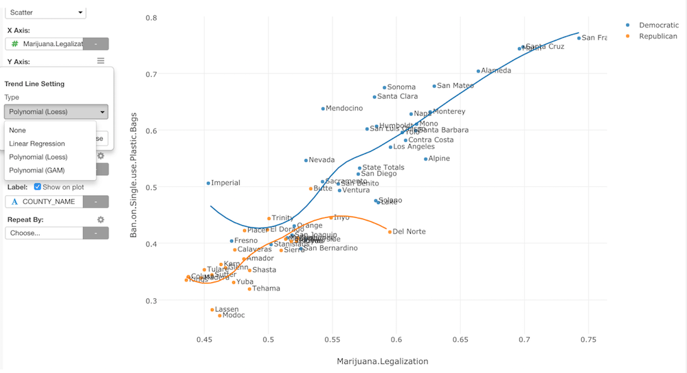
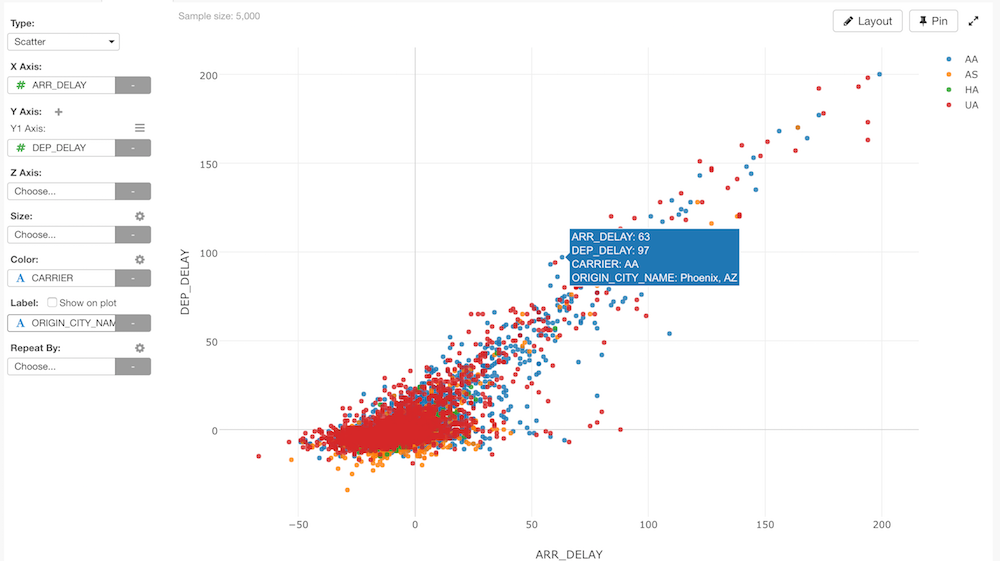

## Scatter Chart

## Column Assignments

* X-Axis - Assign a column you want to show at X-Axis. If it is a date / time column assigned, the axis will be automatically in time series. If it is a number based column, the axis will be for the continuous values. If it is a text based column, the axis will be for discrete values. 

* Y-Axis - Assign a column you want to show at Y-Axis. The assigned column is handled in the same way as X-Axis.  

* Z-Axis - Assign a column you want to show at Z-Axis. By assigning Z-Axis, the chart becomes 3D Scatter chart. The assigned column is handled in the same way as X-Axis. Note Z-Axis is disabled on Windows platform because 3D Scatter chart is currently not supported on Windows. 

* Size - Assign a column you want to apply the size on each circle. You can assign a number based column only. 

* Color - Take a look at [Color](color.md) section for more details.

* Label - Assign a column you want to show in the balloon help that you see when you hover the marker such as dots. 

If you check the `Show on plot` option, the column values directly come up in the plot area. 

* Repeat By - You can assign a column to repeat the chart for each of its values. Take a look at [Small Multiple](small-multiple.md) section for more details.

You can assign multiple columns to Y-Axis. Take a look at [Multiple Y-Axis](multi-y.md) section for more details.

## Trend Line and Confidence Interval

<take stuff from here>
https://blog.exploratory.io/exploratory-v3-1-released-62e7a2974d4b
https://blog.exploratory.io/exploratory-v3-2-released-da940b794043

## Range

https://blog.exploratory.io/exploratory-v3-1-released-62e7a2974d4b

## Circle for Color 

https://blog.exploratory.io/exploratory-v3-1-released-62e7a2974d4b

## Layout Configuration

Take a look at [Layout Configuration](layout.md) on how to configure the layout and format. 
